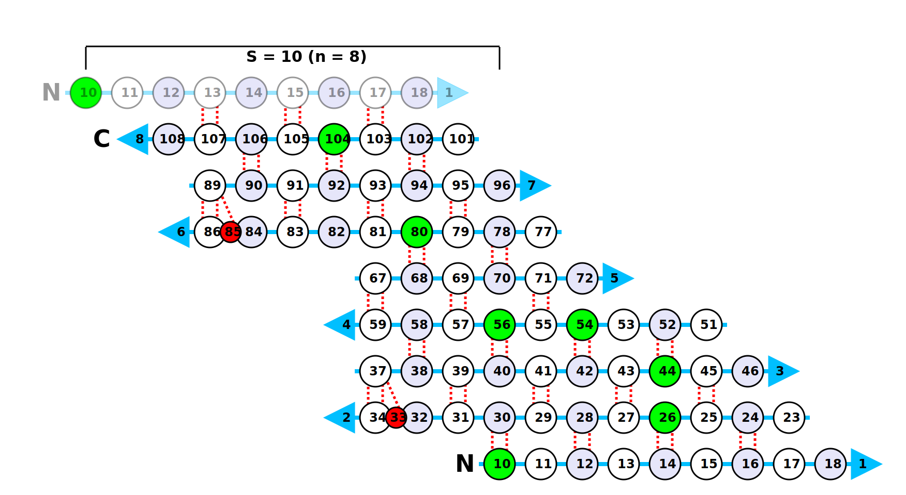

# *generate2dstrandmap*
This script generates a 2d beta strand map in SVG. The default script configuration colors glycines green, beta-bulges red, and 3-10 helices yellow.



## Dependencies

pyrosetta

## Usage

```
./generate2dstrandmap.py 6d0tA.pdb
```

## Usage details

```
./generate2dstrandmap.py -h
```
